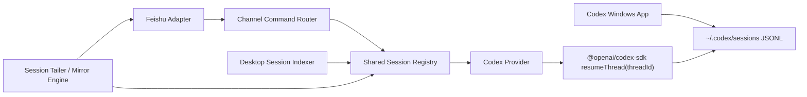
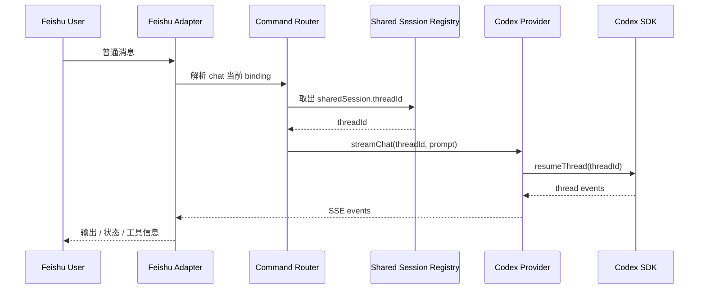

# Codex-to-IM 共享 Thread 技术设计

## 1. 文档目标

本文档在 PRD 的基础上，进一步定义 `codex-to-im` 的共享 thread 架构。

关注点不是 IM 渠道接入本身，而是：

- 如何发现 `Codex Windows App` 的真实会话
- 如何把飞书 chat 绑定到同一条底层 `thread_id`
- 如何让桌面端和飞书端围绕同一条 thread 无缝切换
- 如何在多会话、多入口条件下保持上下文、状态和并发行为可控

## 2. 设计结论

### 2.1 可行性结论

共享 thread 方案可行。

当前本地环境已验证：

- `@openai/codex-sdk` 支持 `startThread()` 和 `resumeThread(threadId)`
- SDK README 明确说明 thread 持久化在 `~/.codex/sessions`
- 本机 `~/.codex/sessions/**/*.jsonl` 中可以稳定读取到：
  - `session_meta.payload.id`
  - `session_meta.payload.cwd`
  - `session_meta.payload.originator`
  - `session_meta.payload.source`

这意味着系统可以：

- 发现桌面端最近的真实会话
- 以 `thread_id` 为唯一真相源
- 通过 `resumeThread(threadId)` 从飞书继续向同一条会话写入

### 2.2 不确定点

当前没有公开证据表明外部程序可以可靠读取“Codex Windows App 当前聚焦 tab”。

因此第一阶段不应依赖“自动接管当前 tab”，而应采用：

- 显式共享当前会话
- 或显式选择最近桌面会话

## 3. 设计原则

### 3.1 单一真实会话

桌面端和飞书端必须共享同一条底层 `thread_id`。

不采用以下模型：

- 桌面端一条 thread
- 飞书端另一条 thread
- 再做文本搬运或伪同步

### 3.2 桌面优先

`Codex Windows App` 是主工作台。

飞书是远程控制和远程观察端，不是独立主入口。

### 3.3 显式绑定优先于猜测

系统可以帮助用户发现候选桌面会话，但不能假设“最近会话”必然就是用户当前想共享的会话。

因此所有共享动作都应是显式确认。

### 3.4 文本命令优先于卡片能力

飞书卡片、按钮、富交互可以增强体验，但会话切换和 thread 绑定必须能通过固定文本命令完成。

## 4. 术语定义

### 4.1 Desktop Session

由 `Codex Windows App` 或本地 Codex SDK 产生的真实会话，底层由 `thread_id` 标识，并持久化在 `~/.codex/sessions`。

### 4.2 Shared Session

`codex-to-im` 产品层暴露给用户的“共享会话”。

一个 `Shared Session` 对应一个底层 `thread_id`，并附加便于用户理解和管理的元信息。

### 4.3 Channel Control Binding

某个 IM chat 当前控制哪个 `Shared Session` 的绑定关系。

第一阶段默认规则：

- 一个飞书 chat 同时只控制一个活动共享会话

### 4.4 Mirror

将 thread 中产生的增量事件同步到飞书，包括：

- 模型输出
- 工具调用
- 状态变化
- 权限请求

## 5. 总体架构



### 5.1 组件分层

- `Desktop Session Indexer`
  - 扫描 `~/.codex/sessions`
  - 发现最近桌面会话
  - 维护 thread 元信息索引
- `Shared Session Registry`
  - 把产品层共享会话映射到底层 `thread_id`
  - 保存展示名称、工作目录、最后活跃时间、共享状态
- `Channel Command Router`
  - 解析飞书固定命令
  - 负责会话选择、切换、绑定、停止
- `Session Tailer / Mirror Engine`
  - tail `~/.codex/sessions` 对应 JSONL
  - 把桌面端新增事件推送到飞书
- `Codex Provider`
  - 用 `resumeThread(threadId)` 继续同一条 thread
  - 把飞书消息送入共享会话

## 6. 与现有实现的衔接

当前代码中已经存在可复用的基础能力：

- [D:/codex/Claude-to-IM-skill/src/codex-provider.ts](D:/codex/Claude-to-IM-skill/src/codex-provider.ts)
  - 已具备 `sdkSessionId` 复用逻辑
  - 已使用 `startThread()` / `resumeThread()`
- [D:/codex/Claude-to-IM-skill/src/store.ts](D:/codex/Claude-to-IM-skill/src/store.ts)
  - 已能持久化 session、binding、message、lock
  - binding 已保存 `sdkSessionId`
- [D:/codex/Claude-to-IM-skill/src/lib/bridge/channel-router.ts](D:/codex/Claude-to-IM-skill/src/lib/bridge/channel-router.ts)
  - 已支持 chat 到 session 的自动解析与绑定
- [D:/codex/Claude-to-IM-skill/src/lib/bridge/bridge-manager.ts](D:/codex/Claude-to-IM-skill/src/lib/bridge/bridge-manager.ts)
  - 已支持 `/new`、`/thread`、`/status`、`/sessions`、`/stop`

当前缺失的不是桥接基础设施，而是“桌面真实会话接管”的这一层：

- 现有 `/sessions` 列出的主要是 bridge 自己管理的 session
- 还没有桌面 session 发现器
- 还没有针对 `~/.codex/sessions` 的 tail mirror
- 还没有“飞书显式切换到某条桌面 thread”的正式模型

## 7. 数据模型

### 7.1 DiscoveredDesktopSession

表示从 `~/.codex/sessions` 扫描得到的候选桌面会话。

```ts
interface DiscoveredDesktopSession {
  threadId: string;
  filePath: string;
  cwd: string;
  originator: string;
  source?: string;
  cliVersion?: string;
  firstSeenAt: string;
  lastEventAt: string;
  title?: string;
  activeEstimate: boolean;
}
```

说明：

- `activeEstimate` 只是启发式字段，用于 UI 排序，不能等同于“当前 tab”

### 7.2 SharedSession

表示产品层共享会话。

```ts
interface SharedSession {
  id: string;
  threadId: string;
  displayName: string;
  cwd: string;
  source: "desktop" | "bridge";
  createdAt: string;
  updatedAt: string;
  syncToFeishu: boolean;
  mirrorMode: "off" | "read_only" | "interactive";
  lastEventAt: string;
  lastOutputPreview?: string;
}
```

### 7.3 ChannelControlBinding

表示飞书 chat 当前控制哪个共享会话。

```ts
interface ChannelControlBinding {
  id: string;
  channelType: string;
  chatId: string;
  sharedSessionId: string;
  threadId: string;
  mode: "interactive" | "read_only";
  createdAt: string;
  updatedAt: string;
}
```

### 7.4 MirrorCursor

表示某个 thread 同步到飞书时读到了 JSONL 的哪个位置。

```ts
interface MirrorCursor {
  threadId: string;
  filePath: string;
  offsetBytes: number;
  lastEventHash?: string;
  lastMirroredAt?: string;
}
```

## 8. 本地存储建议

建议在现有 `~/.codex-to-im/data` 下新增以下文件：

- `desktop-sessions.json`
  - 缓存已发现的桌面会话索引
- `shared-sessions.json`
  - 共享会话元数据
- `channel-control-bindings.json`
  - 飞书 chat 当前控制目标
- `mirror-cursors.json`
  - tail 进度

现有文件继续保留：

- `sessions.json`
- `bindings.json`
- `messages/*.json`

原则上：

- `sessions.json` 继续服务 bridge 自己创建的逻辑会话
- `shared-sessions.json` 负责“桌面真实会话接管”场景

## 9. 核心流程

### 9.1 流程 A：发现最近桌面会话

1. `Desktop Session Indexer` 扫描 `~/.codex/sessions/**/*.jsonl`
2. 读取每个文件首条 `session_meta`
3. 抽取 `threadId`、`cwd`、`originator`、`source`
4. 以文件最后修改时间或最后事件时间排序
5. 输出“最近桌面会话”列表给本地 UI

结果：

- 用户可以在 UI 中选择“要共享到飞书的会话”

### 9.2 流程 B：桌面会话共享到飞书

首选交互：

- 在桌面端提供一个按钮：`同步当前会话到飞书`

第一阶段可落地的替代方案：

- 在本地 UI 中列出“最近桌面会话”
- 用户选择其中一条
- 绑定到某个飞书 chat

绑定成功后：

- 创建或更新 `SharedSession`
- 创建或更新 `ChannelControlBinding`
- 启动该 thread 的 mirror

### 9.3 流程 C：飞书继续向共享 thread 发消息



关键点：

- 飞书消息不能再走“新建私有 bridge thread”
- 必须命中当前 chat 绑定的 `threadId`

### 9.4 流程 D：桌面端输出镜像到飞书

1. `Session Tailer` 持续读取目标 JSONL 的新增行
2. 识别出模型输出、工具调用、权限请求、状态事件
3. 生成结构化镜像事件
4. 推送到飞书

镜像内容建议分级：

- 必须同步：
  - 文本输出
  - 工具开始/完成
  - 权限请求
  - 运行中 / 空闲 / 失败
- 可选同步：
  - token 统计
  - 全量原始事件

## 10. 飞书命令模型

### 10.1 第一版命令集

建议保留并扩展以下命令：

- `/status`
  - 查看当前 chat 正在控制的共享会话、thread、工作目录、运行状态
- `/sessions`
  - 列出当前用户可切换的共享会话
- `/use <shared-session-id>`
  - 切换当前 chat 控制的共享会话
- `/threads`
  - 列出最近发现的桌面 thread
- `/thread <thread-id>`
  - 直接把当前 chat 切换到指定 thread 对应的共享会话
- `/new`
  - 新建一条 bridge 自己管理的新共享会话
- `/stop`
  - 停止当前共享会话正在执行的任务

### 10.2 语义划分

- `session`
  - 面向用户的产品层对象
- `thread`
  - 面向 Codex SDK 的底层对象

飞书端必须始终能回答两个问题：

- 我当前控制的是哪个 `Shared Session`
- 它底下对应的是哪个 `thread_id`

## 11. 并发与切换规则

### 11.1 单 thread 串行写入

同一条 `thread_id` 在任意时刻只允许一个写入任务处于运行中。

原因：

- 防止桌面端和飞书端同时向同一 thread 提交输入
- 防止工具链并发执行导致上下文错乱

### 11.2 输入竞争策略

第一阶段建议规则：

- 如果当前 thread 正在运行，飞书新消息进入等待队列
- `/stop` 可以取消当前运行
- 队列中的下一条输入在 thread 空闲后执行

替代策略不建议第一阶段就做：

- 双端抢占式切换
- 自动撤销桌面输入

### 11.3 控制权提示

飞书和本地 UI 都应显示：

- 当前 thread 是否运行中
- 当前消息是否排队
- 最近一次输入来自哪里：
  - `desktop`
  - `feishu`
  - `bridge`

## 12. 去重与镜像规则

### 12.1 风险来源

如果飞书消息通过 `resumeThread(threadId)` 写入，随后 `Session Tailer` 再去读同一 JSONL，就可能把“bridge 自己触发的输出”再次作为桌面更新回推到飞书。

### 12.2 第一版去重方案

为每次 bridge 发起的运行生成 `runId`，并维护：

- `threadId`
- `runId`
- `startedAt`
- `origin = feishu | desktop | bridge-ui`

镜像层在回推飞书时做两层判断：

- 已经通过实时流推送给飞书的 event，不再重复镜像
- 只镜像“来自桌面端新增而非当前 bridge 运行”的事件

### 12.3 保守策略

第一阶段优先保证“不重复刷屏”，即使因此少同步少量边缘事件，也比双发更稳。

## 13. UI 设计要求

### 13.1 本地 UI

本地 UI 需要新增这些视图：

- 最近桌面会话
- 已共享会话
- 每条会话的：
  - thread id
  - cwd
  - 最近活跃时间
  - 是否已同步到飞书
  - 当前绑定的飞书 chat

操作按钮建议包括：

- `同步到飞书`
- `停止同步`
- `复制 thread id`
- `在飞书中接管`

### 13.2 飞书侧反馈

飞书需要能看到：

- 当前会话名称
- 当前 thread 短 id
- 当前 cwd
- 当前状态
- 最近输出预览

## 14. 权限与安全边界

### 14.1 可见性

默认不应把所有本地桌面会话暴露给任意飞书用户。

至少需要：

- 飞书用户白名单
- 或飞书 chat 白名单

### 14.2 接管边界

只有明确授权的飞书聊天，才能：

- 绑定桌面 thread
- 切换共享会话
- 向共享会话发送写入指令

### 14.3 信息披露控制

如果共享会话 cwd 或输出涉及敏感目录，本地 UI 需要允许：

- 关闭飞书同步
- 降级为只读同步

## 15. 分阶段落地方案

### Phase 2A：桌面会话发现

交付目标：

- 扫描 `~/.codex/sessions`
- 列出最近桌面会话
- 在本地 UI 中可选中某条 thread

### Phase 2B：共享 thread 绑定

交付目标：

- 建立 `SharedSession`
- 飞书 chat 可绑定指定 `threadId`
- 飞书普通消息走 `resumeThread(threadId)`

### Phase 2C：镜像输出

交付目标：

- tail JSONL
- 把桌面端新增输出同步到飞书
- 对 bridge 自己已推送事件做去重

### Phase 2D：飞书会话切换

交付目标：

- `/sessions`
- `/use`
- `/threads`
- `/thread`

### Phase 2E：桌面一键共享

交付目标：

- 在 Codex 侧提供显式按钮或可选集成入口
- 允许“把当前会话共享到飞书”

这是最接近“无缝切换”的一步，但仍然应基于显式动作，而非猜测当前焦点 tab。

## 16. 待验证清单

进入编码前，建议先验证以下事实：

1. 当 bridge 使用 `resumeThread(threadId)` 写入后，Codex Windows App 是否会在切回后显示完整新历史
2. Codex Windows App 是否会对该 thread 的外部写入做实时刷新
3. JSONL 中哪些事件最适合用作“镜像到飞书”的来源
4. 同一 thread 在桌面端和 bridge 端交替写入时，是否会出现 SDK 层冲突或异常
5. 是否存在稳定标记来区分“桌面发起的 run”和“bridge 发起的 run”

## 17. 正式建议

共享 thread 架构应成为 `codex-to-im` 的主架构，而不是附加高级功能。

原因很直接：

- 你的主工作流在桌面
- 飞书是补充端，但必须能继续下指令
- 如果不共享真实 thread，就做不到真正的无缝切换

因此后续实现优先级应是：

1. 发现桌面真实会话
2. 绑定共享 thread
3. 飞书远程继续写入同一 thread
4. 桌面输出镜像回飞书
5. 飞书命令切换会话 / thread

## 18. 参考依据

### 本地依据

- [D:/codex/Claude-to-IM-skill/node_modules/@openai/codex-sdk/README.md](D:/codex/Claude-to-IM-skill/node_modules/@openai/codex-sdk/README.md)
- [D:/codex/Claude-to-IM-skill/src/codex-provider.ts](D:/codex/Claude-to-IM-skill/src/codex-provider.ts)
- [D:/codex/Claude-to-IM-skill/src/store.ts](D:/codex/Claude-to-IM-skill/src/store.ts)
- [D:/codex/Claude-to-IM-skill/src/lib/bridge/channel-router.ts](D:/codex/Claude-to-IM-skill/src/lib/bridge/channel-router.ts)
- `%USERPROFILE%/.codex/sessions/**/*.jsonl` 的本地实测样本

### 官方资料

- [Introducing the Codex app](https://openai.com/index/introducing-the-codex-app/)
